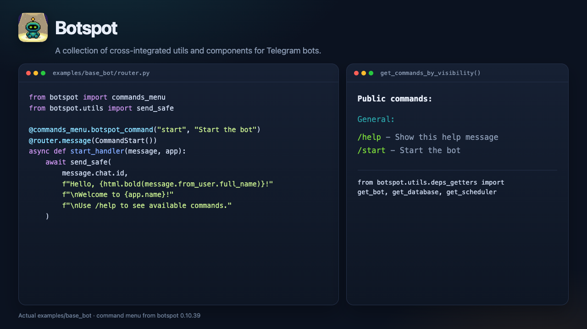

<h1 align="center">
   Botspot
</h1>

<p align="center">
  <strong>A collection of cross-integrated utils and components for Telegram bots.</strong>
</p>

<p align="center">
  <a href="https://github.com/calmmage/botspot"></a>
  <a href="https://github.com/calmmage/botspot/actions/workflows/push-checks.yml"></a>
  <a href="LICENSE"></a>
  
  
</p>

<p align="center">
  <a href="https://docs.aiogram.dev"><kbd>aiogram</kbd></a>
  &nbsp;
  <a href="https://core.telegram.org/bots"><kbd>Telegram Bot API</kbd></a>
</p>

<h3 align="center"><a href="#install"><ins>Install botspot</ins></a></h3>

<p align="center">
  <a href="docs/examples/hero.png"></a>
</p>

Connect botspot components to an [aiogram](https://docs.aiogram.dev) dispatcher. Featured: `user_data` and `send_safe`. Access components via the singleton `deps` object and `deps_getters`.

## Install

Needs **Python ≥ 3.12** and a bot token from [@BotFather](https://t.me/BotFather).

Clone the [botspot-template](https://github.com/calmmage/botspot-template), copy `example.env`, enable the components you want, then run:

```bash
git clone https://github.com/calmmage/botspot-template.git your-bot-name
cd your-bot-name
cp example.env .env          # set TELEGRAM_BOT_TOKEN
python run.py
```

Component usage examples live in [`examples/`](examples/). Generally, you can access components via singleton `deps` and deps_getters:

```python
from botspot.utils.deps_getters import get_bot, get_database, get_scheduler
```

**Agents:** follow **[AGENTS.md](AGENTS.md)** for the component checklist and the `examples/base_bot` pattern.

### Library

This repo is the library (v0.10.39). Add it from git — the PyPI `botspot` project is an older 0.1.x snapshot:

```bash
uv add git+https://github.com/calmmage/botspot.git
```

## What you get

| Surface | What it is |
|---------|------------|
| **Core** | `BotManager` wires components into your aiogram dispatcher |
| **Components** | Data, features, middleware, QoL — enable with env / settings. Featured: `user_data` |
| **Utils** | `send_safe` (split, format, auto-delete) and `deps_getters` |
| **Commands** | `@botspot_command` builds `/help` and the Telegram command menu |

## Docs

| | |
|---|---|
| This page, install, example | [docs/index.md](docs/index.md) |
| Component demos | [examples/](examples/) |
| Agent install / conventions | [AGENTS.md](AGENTS.md) |
| Vulnerability reports | [SECURITY.md](SECURITY.md) |

```bash
uv run pytest     # tests
uv run ruff check botspot
```

## License

GPL-3.0 — see [LICENSE](LICENSE). Vulnerabilities: [SECURITY.md](SECURITY.md).
